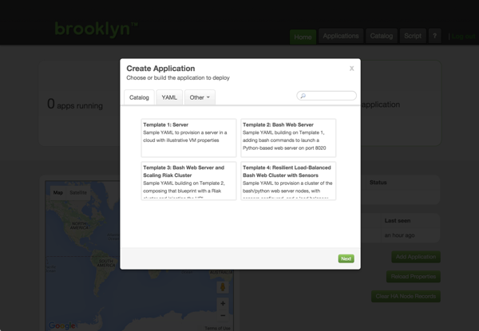
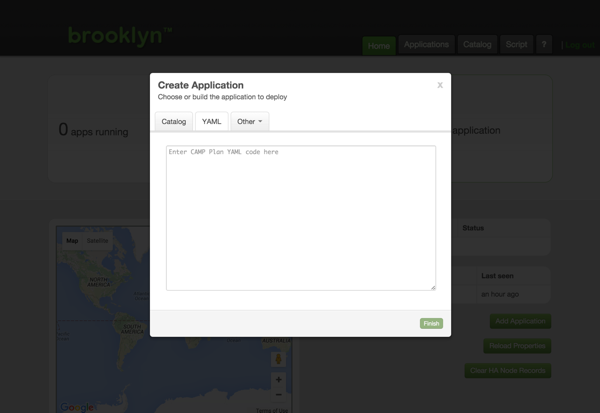



### Launching from the Catalog

Download the template [catalog.xml](catalog.xml) to your `~/.brooklyn/` folder, and relaunch Brooklyn.

Now when we open the web console, two applications are displayed from the catalog.

Select the 'Demo Web Cluster with DB' and click 'Next'.

Select the Location that Brooklyn should deploy to, and name your application then click 'Finish' to launch the application as before.

## Launching from a blueprint

There are several ways to deploy a YAML blueprint (including specifying the blueprint on the command line or submitting it via the REST API).

For now, we will simply copy-and-paste the raw YAML blueprint into the web console.

Open the web console ([127.0.0.1:8081](http://127.0.0.1:8081)). As Brooklyn is not currently managing any applications the 'Create Application' dialog opens automatically. Select the YAML tab.

Copy this document into the large text box on the YAML tab, labelled `Enter CAMP Plan YAML code here`. But *before* you
submit it, we need to make a modification.





Find the line near the top of the blueprint that starts `location:`. Change the line to name a location. For example,
one of these lines:


location: aws-ec2:us-east-1
location: rackspace-cloudservers-us:ORD
location: google-compute-engine:europe-west1-a
location: localhost


**My Web Cluster Blueprint**

With the modified YAML in the dialog, click 'Finish'. The dialog will close and Brooklyn will begin deploying your
application. Your application will be shown as 'Starting' on the web console's front page.

### Next 

So far we have touched on Brooklyn's ability to *deploy* an application blueprint to a cloud provider, but this a very small part of Brooklyn's capabilities!
