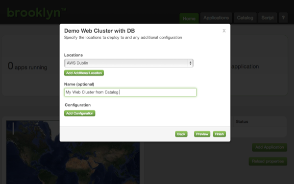



In the [previous step](blueprint.html) we downloaded Brooklyn and used it to deploy an application to a cloud, 
but at its heart Brooklyn is a policy driven *management* plane.

Here we will introduce a Service Catalog and then proceed to load and configure Polices from it.

We strongly advise that you complete [the first tutorial](index.html) before proceeding with this one, to make sure that
your machine is correctly configured to be able to run Brooklyn applications. Like the previous tutorial, we are also
assuming that you are running Linux or Mac OSX.

### Setting Up the Catalog

Download the template [catalog.xml](catalog.xml) to your `~/.brooklyn/` folder, and relaunch Brooklyn.


$ cd ~/.brooklyn
$ wget {{site.url_root}}{{site.path.guide}}/start/catalog.xml

$ brooklyn launch


Now when we open the web console, two applications are displayed from the catalog.

Select the 'Demo Web Cluster with DB' and click 'Next'.

Select the Location that Brooklyn should deploy to, and name your application:

Click 'Finish' to launch the application as before.

### Next 

Next, learn how to set up and configure policies to automatically *manage* applications you've deployed. 

[Getting Started - Policies](policies.html)
