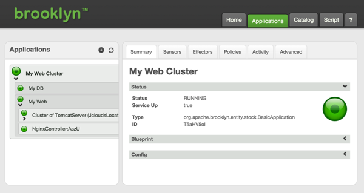
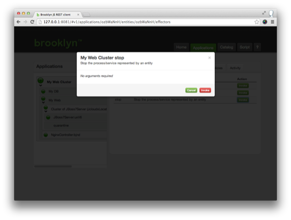

Click on the application name, or open the Applications tab.

We can explore the management hierarchy of the application, which will show us the entities it is composed of.

 * My Web Cluster (A `BasicApplication`)
     * My DB (A `MySqlNode`)
     * My Web (A `ControlledDynamicWebAppCluster`)
        * Cluster of JBoss7 Servers (A `DynamicWebAppCluster`)
        * NginxController (An `NginxController`)

Clicking on the 'My Web' entity will show the Summary tab. Here we can see if the cluster is ready to serve and, when ready, grab the web address for the front of the loadbalancer.

The Activity tab allows us to drill down into what activities each entity is currently doing or has recently done. It is possible to drill down to all child tasks, and view the commands issued, and any errors or warnings that occured.

Drill into the 'My DB' start operation. Working down through  'Start (processes)', then 'launch', we can discover the ssh command used including the stdin, stdout and stderr.

## Stopping the Application

To stop an application, select the application in the tree view (the top/root entity), click on the Effectors tab, and invoke the 'Stop' effector. This will cleanly shutdown all components in the application and return any cloud machines that were being used.

### Next

Brooklyn's real power is in using [Policies](policies.html)  to automatically *manage* applications. 
