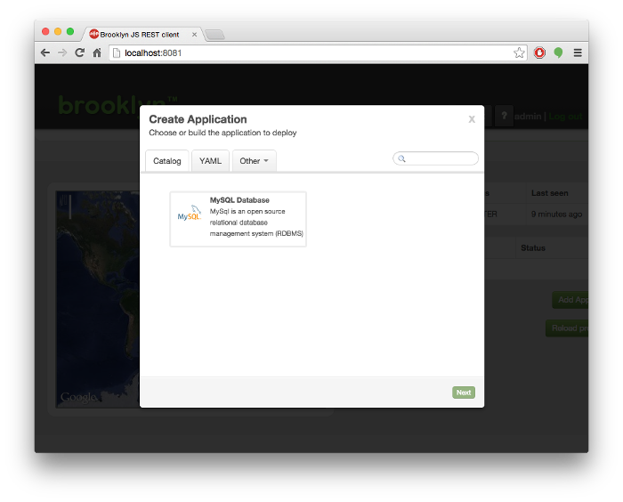

In addition to deploying [YAML blueprints](creating-yaml.md) directly through the web console, it is possible
to add YAML blueprints to the catalog, which can then be deployed by selecting them from the 'Catalog' section of
the 'Create Application' dialog.

In order to add a YAML blueprint to the catalog, the root entity must ultimately extend `brooklyn.entity.Application`,
and the blueprint must contain a `brooklyn.catalog` section. Once this has been done, we can add the blueprint to the
catalog via Brooklyn's REST API.

Let's take the following YAML as a starting point:

```
name: MySQL Database

location: localhost

services:
- type: brooklyn.entity.database.mysql.MySqlNode
  brooklyn.config:
    datastore.creation.script.url: classpath://visitors-creation-script.sql
```

The first thing we need to do is add a root element that extends `brooklyn.entity.Application`. As we don't require any
custom application-specific logic, we can use the `brooklyn.entity.basic.BasicApplication` class. We can then add our
MySqlNode as a child of the BasicApplication. When deploying a YAML blueprint via the YAML page of the 'Add Application'
modal, Brooklyn will do this automatically, however, in order to add our blueprint to the catalog, we will need to this
manually as follows:

```
name: MySQL Database

location: localhost

services:
- type: brooklyn.entity.basic.BasicApplication
  brooklyn.children:
  - type: brooklyn.entity.database.mysql.MySqlNode
    brooklyn.config:
      datastore.creation.script.url: classpath://visitors-creation-script.sql

```

The next step is to remove the location (as the user will select the location in the GUI), and add a brooklyn.catalog
section to tell Brooklyn how the blueprint should be displayed in the 'Add Application' modal:

```
name: MySQL Database

brooklyn.catalog:
  id: MySQL
  version: 1.0
  iconUrl: classpath://mysql.png
  description: MySql is an open source relational database management system (RDBMS)

services:
- type: brooklyn.entity.basic.BasicApplication
  brooklyn.children:
  - type: brooklyn.entity.database.mysql.MySqlNode
    brooklyn.config:
      datastore.creation.script.url: classpath://visitors-creation-script.sql
```

- The `id: MySQL` section specifies a unique ID used by Brooklyn to identify the catalog item. This ID is also passed to 
`UsageManager.UsageListener.onApplicationEvent` for metering purposes.
- The `version: 1.0` section provides a unique version for the *blueprint*. NOTE: This is *not* the version of the software
being installed (in this case MySQL).
- The `iconUrl: classpath://...` is an optional, but recommened, section that allows you to provide a graphic to be 
displayed in the 'Add Application' modal alongside the blueprint name. These image files should be placed in the 
`conf` folder to make them available at runtime.
- The `description: ...` section allows you to give a free-format description of the blueprint, which is displayed in the 
'Add Application' modal.

To add the blueprint to the catalog, post the YAML file to Brooklyn's REST API by using the `curl` command as
follows:

```
curl -u admin:password http://127.0.0.1:8081/v1/catalog --data-binary @/Users/martin/Desktop/ms.yaml
```

This will add the blueprint to the catalog as shown here:
[](mysql-in-catalog.png) 

If you attempt to run the curl command a second time, you will receive an error stating `Updating existing catalog entries is forbidden`.
To update the blueprint, you will need to change the version number in your yaml file before running the curl command 
again. This will create a second blueprint - you can then delete the old version via the REST API, using its ID and version
as follows:

```
curl -u admin:password -X DELETE http://127.0.0.1:8081/v1/catalog/entities/MySQL/1.0
```

