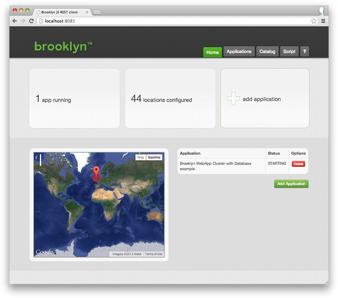
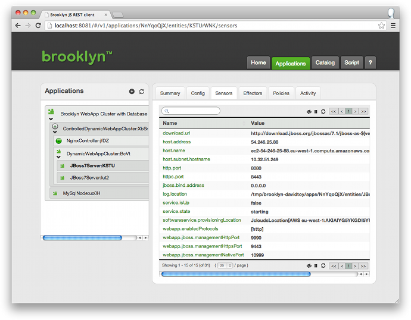
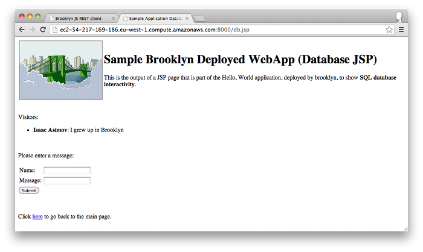



## Intro

Brooklyn makes it easy to describe the structure and management of sophisticated distributed applications, 
and then it makes it easy to launch them in a cloud, with on-going automated management.

This walkthrough will set up a sample application which you can use as foundation for creating your own applications.

The sample application is a three tier web service, composed of:

* an Nginx load-balancer
* a cluster of JBoss appservers
* a MySQL database

## Download the Sample Project

If you'd like to follow these steps on your machine, you can use Maven to 
download the Brooklyn quickstart archetype and setup a `brooklyn-sample` directory and project. 
Maven will automatically download Brooklyn and all dependencies.
You can of course follow this walkthrough without installing it on your machine ... yet!




$ export BROOKLYN_VERSION=0.6.0-rc.2
$ mvn archetype:generate \
    -DarchetypeGroupId=io.brooklyn \
    -DarchetypeArtifactId=brooklyn-archetype-quickstart \
    -DarchetypeVersion=${BROOKLYN_VERSION} \
    -DarchetypeCatalog=https://oss.sonatype.org/content/repositories/snapshots/archetype-catalog.xml \
    -DgroupId=com.acme.sample \
    -DartifactId=brooklyn-sample \
    -Dversion=0.1.0-SNAPSHOT \
    -Dpackage=com.acme.sample.brooklyn
$ cd brooklyn-sample


*Note*: As this is a snapshot version of Brooklyn, the code above includes a `-DarchetypeCatalog` specification.
This can be omitted for release versions, or if you already have a local `mvn install` of Brooklyn installed as described [here]({{site.url}}/dev/code/index.html).




$ export BROOKLYN_VERSION=0.6.0-rc.2
$ mvn archetype:generate \
    -DarchetypeGroupId=io.brooklyn \
    -DarchetypeArtifactId=brooklyn-archetype-quickstart \
    -DarchetypeVersion=${BROOKLYN_VERSION} \
    -DgroupId=com.acme.sample \
    -DartifactId=brooklyn-sample \
    -Dversion=0.1.0-SNAPSHOT \
    -Dpackage=com.acme.sample.brooklyn
$ cd brooklyn-sample




## Define your Application Blueprint

An application blueprint is defined as a Java class, as follows:


public class ClusterWebServerDatabaseSample extends AbstractApplication {
    @Override
    public void init() {
        MySqlNode mysql = addChild(EntitySpec.create(MySqlNode.class));
        ControlledDynamicWebAppCluster web = addChild(EntitySpec.create(ControlledDynamicWebAppCluster.class));
    }
}


The file `ClusterWebServerDatabaseSample.java` in `src/main/java/com/acme/sample/brooklyn/sample/app/` 
provides a template to follow.

## Deploying the Application

If you have not already done so, follow the section in the 
[Getting Started Guide]({{site.url}}/use/guide/quickstart/index.html) to create a `brooklyn.properties` 
file containing credentials for your preferred cloud provider. 

To launch this application, build the project and run the `start.sh` script in the resulting assembly:


$ mvn clean assembly:assembly

$ cd target/brooklyn-sample-0.1.0-SNAPSHOT-dist/brooklyn-sample-0.1.0-SNAPSHOT/

$ ./start.sh application \
    --class com.acme.sample.brooklyn.ClusterWebServerDatabaseSample \
    --location jclouds:aws-ec2:eu-west-1


(Amazon is used in this walkthrough, but lots of targets are supported,
including `--location localhost`, fixed IP addresses, and 
everything supported by [jclouds](http://jclouds.org), from OpenStack to Google Compute.)

Your console will inform you that it has started a Brooklyn console at [http://localhost:8081](http://localhost:8081)

 

The management console provides a view on to the entities that launched,
including the hierarchy (appservers grouped into a cluster) and their locations. 

Brooklyn collects information from these entities ("sensors"), 
aggregates these for clusters and other groups (using "enrichers"),
and exposes operations ("effectors") that can be performed on entities.

 

## Topology, Dependencies, and Management Policies

Of course in the real world, application deployments are more interesting;
they do things and need configuration.  For instance you might need to:

* specify a WAR file
* initialize the database
* tell the webapp servers where to find the database

Let's show how these are done using Brooklyn.
We assume the WAR file and the database init script are accessible
on the classpath, but a range of URL formats is supported.
The "dependent inter-process configuration" -- giving the database's URL
to the webapps -- we'll do here with a JVM system property,
but you're free to use any mechanism you wish.

Under the covers, ``attributeWhenReady`` is monitoring a sensor from MySQL
and generating a string to pass to the webapp software processes; ``formatString``
is a similar utility that returns a string once all of its parts have been resolved.
Due to the use of futures, the Brooklyn webapp entities will automatically
block "at the last moment" when the value is needed
(but after e.g. the VMs have been provisioned, to speed things up).


public class ClusterWebServerDatabaseSample extends AbstractApplication {
    @Override
    public void init() {
        MySqlNode mysql = addChild(EntitySpec.create(MySqlNode.class)
                .configure(MySqlNode.CREATION_SCRIPT_URL, "classpath://visitors-database-setup.sql"));
        
        ControlledDynamicWebAppCluster web = addChild(EntitySpec.create(ControlledDynamicWebAppCluster.class)
                .configure("memberSpec", EntitySpec.create(JBoss7Server.class)
                        .configure("httpPort", "8080+")
                        .configure("war", WAR_PATH)
                        .configure(JavaEntityMethods.javaSysProp("brooklyn.example.db.url"), 
                                formatString("jdbc:%s%s?user=%s\\&password=%s", 
                                        attributeWhenReady(mysql, MySqlNode.MYSQL_URL), DB_TABLE, DB_USERNAME, DB_PASSWORD))));
    }
}


We now see our app at the Nginx URL:

 

Finally, we'll bring in some active management: we're going to monitor requests per second,
and scale out if this exceeds 100 up to a maximum of 5 servers.
This is a naively simple policy, but it shows Brooklyn's real metier,
running management policies for applications whose topology it knows. 


        web.getCluster().addPolicy(AutoScalerPolicy.builder().
                        metric(DynamicWebAppCluster.AVERAGE_REQUESTS_PER_SECOND).
                        sizeRange(1, 5).
                        metricRange(10, 100).
                        build());

        
*Policies* in Brooklyn typically subscribe to sensors,  perform some computation, and if necessary invoke effectors on entities.  This is where the ability to group entities
becomes very useful -- policies can be attached to group entities, and groups themselves can be hierarchical. It's also handy that often Brooklyn creates the entities,
so it knows what the hierarchy is.

Under the covers, this ``AutoScalerPolicy`` attaches to any ``Resizable`` entity (exposing a ``resize`` effector), and monitors a specified sensor (or function) attempting to keep it within healthy limits. A separate policy operates at the ``Controlled`` cluster to ensure the load-balancer is updated as the pool of web servers expands and contracts.

Fire up a JMeter session (or other load testing tool) and blast the Nginx address. The auto-scaler policy will scale up the cluster.

## What Next?
 
In addition to the sample project created by the archetype, with its README and
`assembly` build, you can find additional code related to this example included with Brooklyn as the ``simple-web-cluster`` example,
described [in detail here]({{site.url}}/use/examples/webcluster).

For your applications, you might want to mix in other data stores, messaging systems, or on-line services including PaaS.
Brooklyn supports some of these out-of-the-box, including a wide-range of tools which it can use Whirr to provision, such as Hadoop.
But if you have something you don't see, 
[let us know]({{site.url}}/meta/contact.html) -- 
we want to work with you to 
[write a new entity]({{site.url}}/dev/code/entity.html) or
[policy]({{site.url}}/dev/code/policy.html) 
and [contribute it]({{site.url}}/dev/how-to-contrib.html).

<!--

Alternatively you can just add a ``main`` method to the application class as follows:


    public static void main(String[] argv) {
        List<String> args = Lists.newArrayList(argv);
        String port =  CommandLineUtil.getCommandLineOption(args, "--port", "8081+");
        String location = CommandLineUtil.getCommandLineOption(args, "--location", DEFAULT_LOCATION);

        BrooklynServerDetails server = BrooklynLauncher.newLauncher()
                .webconsolePort(port)
                .launch();

        Location loc = server.getManagementContext().getLocationRegistry().resolve(location);

        StartableApplication app = new WebClusterDatabaseExample()
                .appDisplayName("Brooklyn WebApp Cluster with Database example")
                .manage(server.getManagementContext());
        
        app.start(ImmutableList.of(loc));
        
        Entities.dumpInfo(app);
    }


Compile and run this with the [``brooklyn-all`` jar]({{site.url}}/start/download.html) on the classpath,
pointing at your favourite WAR on your filesystem. 
(If the ``import`` packages aren't picked up correctly,
you can cheat by looking at [the file in Github](https://github.com/brooklyncentral/brooklyn/blob/master/examples/simple-web-cluster/src/main/java/brooklyn/demo/WebClusterDatabaseExample.java);
and you'll find a sample WAR which uses the database as configured above 
[here](https://http://ccweb.cloudsoftcorp.com/maven/libs-snapshot-local/io/brooklyn/).)
 TODO example webapp url 
 
If you want to adventure beyond ``localhost`` (the default),
simply supply the your favourite cloud (e.g. ``aws-ec2:eu-west-1``)
with credentials set up as described [here]({{ site.url }}/use/guide/management/index.html#startup-config).

-->
